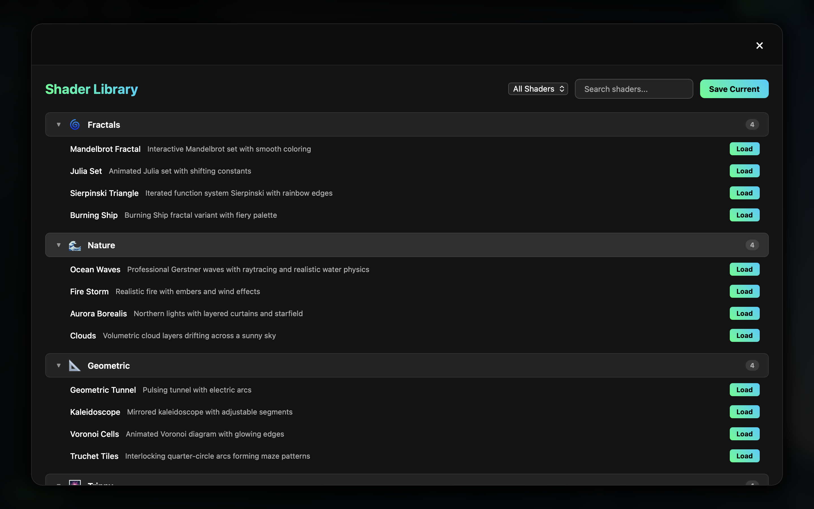
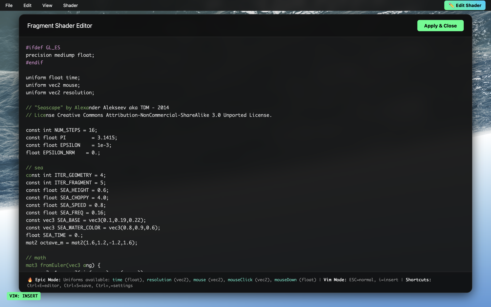

# Shader Editor 

A web-based GLSL shader editor and playground for creating stunning real-time visual effects.

## Features

- **Live GLSL Editor** - Edit fragment shaders with instant feedback
- **Shader Library** - 10+ pre-built shaders including fractals, waves, and procedural patterns
- **Interactive Controls** - Use mouse input, time-based animations, and custom uniforms
- **Vim Mode Support** - Full vim keybindings for editing
- **Dark Theme** - Eye-friendly interface optimized for creative work

## Screenshots

### Shader Library

### Fractal Visualization

### Ocean Simulation

### Fragment Shader Editor

## Usage

Open `index.html` in a modern web browser and start creating. Click the "Edit Shader" button to access the editor.

### Available Uniforms
- `time` (float) - Time in seconds
- `resolution` (vec2) - Canvas resolution
- `mouse` (vec2) - Current mouse position
- `mouseClick` (vec2) - Last mouse click position
- `mouseDown` (float) - Mouse button pressed (0.0 or 1.0)

### Keyboard Shortcuts
- `Ctrl+E` - Open editor
- `Ctrl+S` - Save shader
- `Ctrl+,` - Open settings
- `ESC` - Enter vim normal mode
- `i` - Enter vim insert mode

